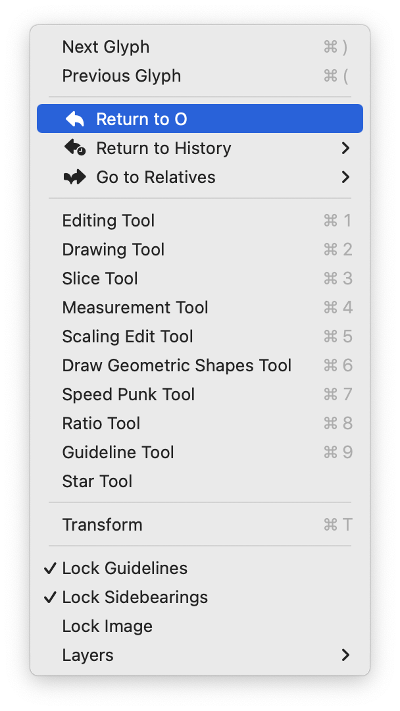
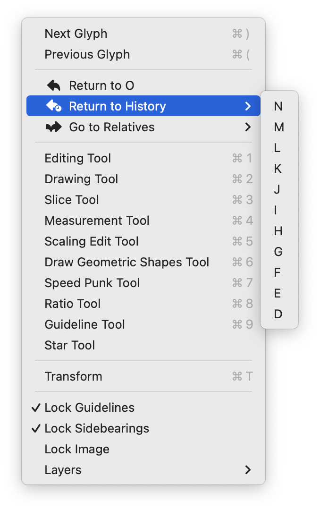
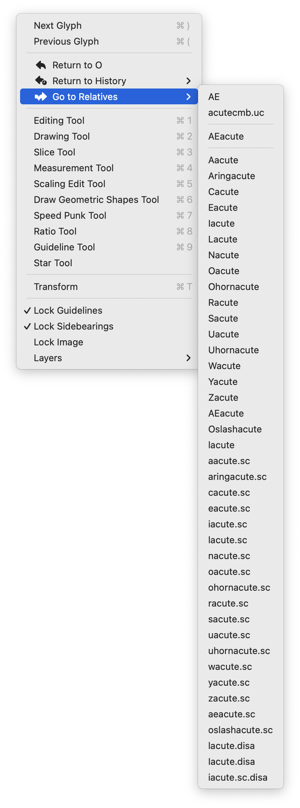

# Return 2 Glyph

- Return to the previous CurrentGlyph using ⇧+,
- Return to a history of previous CurrentGlyphs using the Robofont > Glyph menu
- Go to related glyphs using the Robofont > Glyph menu
- Probably requires Robofont version 4.4b

### What's New : Version 1.2

 - menu is built better (no more placeholders!)
 - new menu icons
 - added "related glyphs" menu that lists
   - components used in the current glyph
   - glyphs that use this current glyph as a component ("dependents")
   - glyphs that use the current glyph's components as a component ('family')
   - each group separated by a line to help give some kind of order

### Screenshots are nice

### Questions for the future

- is the related glyphs feature too heavy?
- should this be a glyph window contextual menu instead of a main application menu?
- should there be ui to view and pick from history & related glyphs?
- how do I show the ⇧+, keyboard shortcut next to the "Return to ..." menu item.
- should this have a customizeable shortcut? I use ⇧+, because Fontlab ruined my brain. Young bucks might find ⇧+⌘+( more intuative.

### History

**Version 1.1**

- Improved Glyph menu items
- Added SF symbol icons to menu items for kicks
- Got the history working (with some minor issues)

**Version 1.0**

- Added a menu item in the Glyph menu to help remind me this tool exists
- Turned into a proper Robofont Extension

